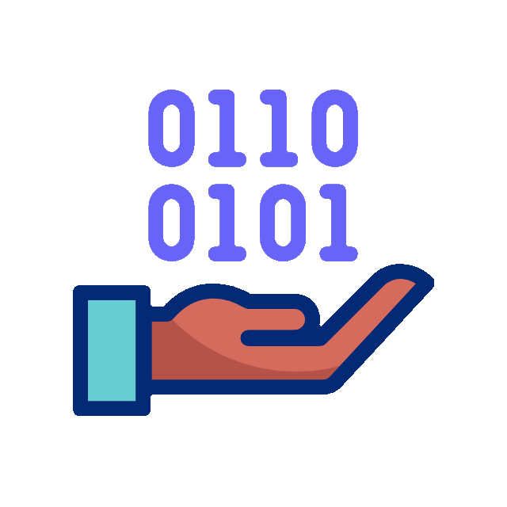

- 🌱 Desenvolvo jogos 2D e 3D com Godot por hobby.
- ⚡ Gosto de estudar novas tecnologias, e aperfeiçoar minhas skills.
- 👔 Desenvolvedor Full-Stack e Analista de Sistemas com sólida experiência em arquitetura Java e ecossistema Node.js. Especialista em automação de processos, metodologias ágeis (Scrum Master) e entrega de soluções escaláveis utilizando Clean Code. Adotando práticas de Spec-Driven Development (SDD) para garantir precisão técnica e impulsionando a produtividade através do desenvolvimento assistido por IA (Cursor, Antigravity), otimizando a velocidade de entrega sem comprometer a qualidade.  Histórico comprovado na liderança de equipes (Tech Lead) e na implementação de sistemas críticos para os setores de transporte e financeiro, com foco constante em eficiência operacional e qualidade de código. 
#
### Formação

- MBA em gestão de projetos - Unopar.
- Pós Graduado Projetos e arquiteturas em cloud computing - Anhanguera.
- Graduado em Análise e Desenvolvimento de Sistemas - PUC-GO. 
#
### Contato

 
   
 
 

 

### Linguagens e Tecnologias

     
   
    
  
    
    
    
   
   
  
  
  
   

  ##

 ### Estatísticas 

   
   <!--  -->
 
   
  

